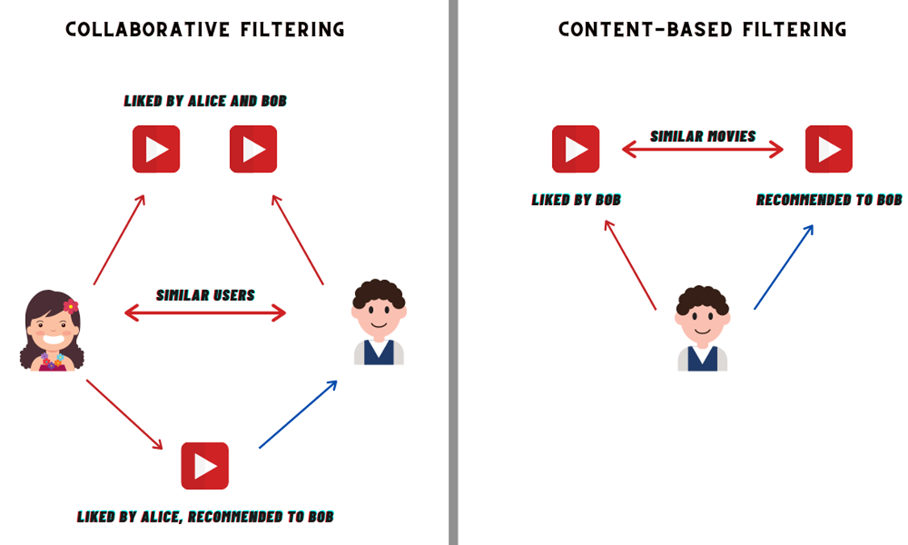
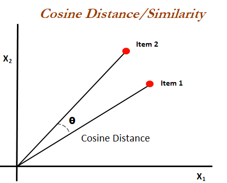
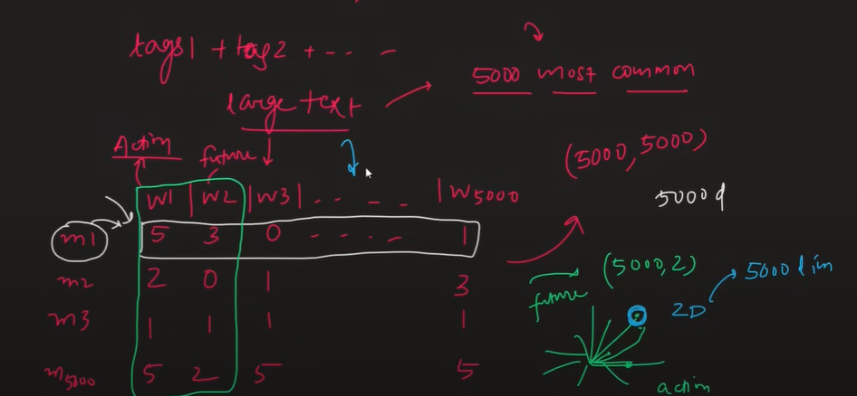
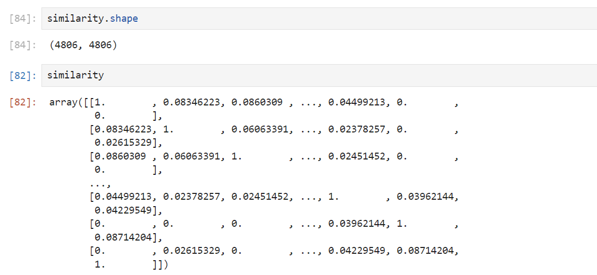

# TMDB_Movie_Recommendation_System with Deployment Using Heroku

Recommender systems, also known as recommendation systems or engines, are a type of software application that provide personalized suggestions to users. These suggestions are typically based on user preferences, behaviors, or the characteristics of items themselves. There are several types of recommender systems, and they can be broadly classified into three main categories: collaborative filtering, content-based filtering, and hybrid methods.

#### Collaborative Filtering :

User-Based Collaborative Filtering: This method recommends items based on the preferences and behaviors of users who are similar to the target user. If User A and User B have similar preferences and User A liked a particular item, User B is likely to be recommended that item.
Item-Based Collaborative Filtering: Instead of comparing users, this approach focuses on the similarity between items. If a user likes a particular item, the system recommends items that are similar to it based on historical user interactions.

#### Content-Based Filtering:

Item Profile-Based: This method recommends items based on a user's preferences and the content features of items. For example, if a user has shown a preference for action movies, a content-based system might recommend action movies with similar characteristics.
User Profile-Based: Recommends items based on the explicit preferences provided by the user. The system creates a profile for each user based on their past interactions and recommends items that match their profile.

#### Hybrid Methods:

Combination of Collaborative and Content-Based: These systems combine both collaborative and content-based approaches to take advantage of their respective strengths. Hybrid methods can be designed to overcome the limitations of individual methods and provide more accurate and diverse recommendations.
Model-Based Collaborative Filtering: Involves using machine learning algorithms to learn the patterns and relationships from user-item interactions. Matrix factorization techniques are commonly used in model-based collaborative filtering.
Knowledge-Based Recommender Systems:
Recommends items based on explicit knowledge about user preferences, item characteristics, and domain expertise. This approach is particularly useful when there is limited user interaction data.

#### Context-Aware Recommender Systems:

Takes into account contextual information such as time, location, and device to provide more personalized recommendations. For example, recommending different types of music during different times of the day.

#### Utility-Based Recommender Systems:

Recommends items based on a utility function that captures the user's preferences and the attributes of the items. The utility function is used to quantify the overall desirability of an item for a particular user.
The choice of a recommender system depends on factors such as the available data, system requirements, and the nature of the items being recommended. Many real-world recommender systems employ a combination of these techniques to achieve better performance.



1)	Create Environment in Anaconda
https://conda.io/projects/conda/en/latest/user-guide/tasks/manage-environments.html#activating-an-environment

2) Connect to github and setup workspace

### Project Overview :
- Import data
- Preprocessing
- Modeling
- Deployment
- Website

Data : https://www.kaggle.com/datasets/tmdb/tmdb-movie-metadata


### Imported data

### Preprocessing

- Budget doesn't make much sense in recommending
- genres is important
- id is important to display in website
- keywords is important in finding similarity
- original_language is not balanced so lets remove it
- overview is important to find the similarity
- popularity, production_companies are not added to not get diverted from main workflow
- title is important
- cast,crew is important to give similarity based on hero heroine director etc

#### New Data frame
This new dataframe consists only 3 columns and tags are made  
Tags -> it is combination of rest of all important columns in the dataset and gives a paragraph at the last

We need to bring the cast, crew etc into proper format    
For doing this literal_eval in ast is required because to convert the string type to list

#### Preprocessing for genres section
#### Preprocessing for keywords section
#### Preprocessing for top 3 cast section
#### Preprocessing crew section to extract director
#### Converting overview section to list to concatenate

##### replacing space which is important in recommednation. Suppose take these two names in the movies

Sam Worthington and Sam mendes  
now if they are split into two different words, our model gets confused to correctly represeent Sam  
so we join both first and last word into single word  

### Text Vectorization

We have tags now, how to get the similarity?

In order to get the similarity between two movies, we need similarity between two tags of them.  
to get the similarity we can find no of similar words or count vectorization  

convert the tags into vectors  using bagofwords, tfidf, word2vec and find the angle between the closest vectors to get the similarity between two movies. cos value close from 0 to 90 degrees gives a similarity range from [1, 0]



The "bag of words" (BoW) model is a common and simple way to represent text data in natural language processing (NLP) and information retrieval. The basic idea behind the bag of words model is to represent a document as an unordered set of its words, disregarding grammar and word order, while keeping track of the frequency of each word. This model is widely used for tasks such as text classification, sentiment analysis, and document retrieval.

Here's a step-by-step explanation of how the bag of words model works:

#### Tokenization:

The first step is to break down a document (or a set of documents) into individual words or tokens. This process is called tokenization. Each word is considered as a discrete unit.
Vocabulary Construction:

Create a vocabulary that includes all unique words from the entire set of documents. This vocabulary serves as the feature set for representing the documents.
#### Word Frequency Count:

For each document, count the frequency of each word in the vocabulary. This results in a set of numerical features representing the frequency of each word in the document.
#### Vector Representation:

Represent each document as a vector in a high-dimensional space, where each dimension corresponds to a unique word in the vocabulary. The value in each dimension is the frequency (or some other measure) of the corresponding word in the document.
#### Sparse Representation:

Most documents will contain only a subset of the words from the vocabulary. As a result, the vectors are typically sparse, meaning that most of the entries are zero. This is because each document is represented only by the words it contains, and the absence of a word is indicated by a zero in the corresponding dimension.
#### Here's a simple example:

#### Consider three documents:

Document 1: "I love natural language processing."
Document 2: "Bag of words is a simple model."
Document 3: "Processing text is an interesting task."
The vocabulary is: 
["I", "love", "natural", "language", "processing", "bag", "of", "words", "is", "a", "simple", "model", "text", "an", "interesting", "task"]

#### The bag of words representation of these documents could be:

Document 1: [1, 1, 1, 1, 1, 0, 0, 0, 0, 0, 0, 0, 0, 0, 0, 0]
Document 2: [0, 0, 0, 0, 0, 1, 1, 1, 1, 1, 1, 1, 0, 0, 0, 0]
Document 3: [0, 0, 0, 0, 1, 0, 0, 0, 1, 0, 0, 0, 1, 1, 1, 1]
Each element in the vector corresponds to the count of the respective word in the document. In practice, variations such as term frequency-inverse document frequency (TF-IDF) may be used to weigh the importance of words in the vector representation.




#### Converting explictly to numpy array, since we get a sparse matrix

### Stemming

lets apply stemming to remove the redundancy of words, like action and actions means the same


### Recommending

we need to calculate cosine similarity and recommend movies.



#### fetinching movie indexes

if we want to sort the similaties in descending order we will be loosing the index values and we cant say which movies similarity is what. for this reason lets use enumerate which converts the similarity into tuples appending index values

#### Create Pickle files of movies data names and similarity indexes

help from : https://www.youtube.com/watch?v=1xtrIEwY_zY&ab_channel=CampusX

## Now lets create a website using Pycharm and streamlit

https://docs.streamlit.io/get-started/installation


``` streamlit run C:\Users\tanub\MovierecommenderSystem\MovierecommenderSystem\venv\app.py ```

#### create web dev code using stream lit

create procfile for deployment : ```web: sh setup.sh && streamlit run app.py```

#### setup.sh file
mkdir -p ~/.streamlit/

echo "\
[server]\n\
port = $PORT\n\
enableCORS = false\n\
headless = true\n\
\n\
" > ~/.streamlit/config.toml

#### Heroku requirements.txt file
this specifies heroku to install libraries present in requirements.txt


